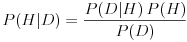
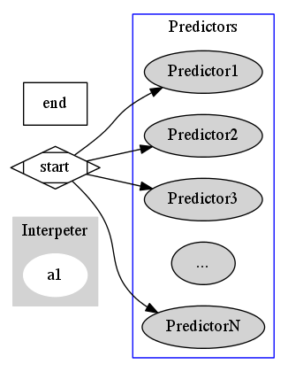

# Interpreter

## Basics

This directory contains the Bayesian interpreter. The interpreter takes in data, runs it through a number of predictors, and then outputs a combined probability distribution using Bayes' Theorem.

The basic idea here is to take a bunch of "expert" predictions and combine them in order to come up with a prediction better than all the experts. Each expert produces a prediction, which we take, weigh based on track record, and then preform a Bayesian update based on this information.

## The Math

Preforming a Bayesian update basically involves applying Bayes Theorem to our priors, hypothesis, and data.

### [Bayesian Inference](http://en.wikipedia.org/wiki/Bayesian_inference)

Bayesian inference is a method of inference which uses Bayes' Theorem to update the probability for a hypothesis.

This is the statement of Bayes' Theorem. 
* P(H|D) is the probability of a hypothesis H given data D. This is what we want, it is called our *posterior*. In our case, the hypothesis might take the form of "Tomorrow the stock will rise by $5" with the data being the next predictor's conclusion.
* P(H) is the probability we assign to H being true before we observe D. This is called our *prior*. As we integrate more data together, we will use the posterior from previous calculations as the prior for the next calculation.
* P(D|H)/P(D) is the impact of D on the probability of H. It consists of the probability of D given H, that is, if the model is true, what would be the probability of the data observed showing up; divided by the [marginal likelihood](http://en.wikipedia.org/wiki/Marginal_likelihood) of D.

There are a number of subjective elements here; that is on purpose. They are thrown out into the open so that we can manipulate and improve them.

When doing Bayesian inference, we want to figure out the posterior from the data. However, we also need a prior, expecially when we do the first calculation. The prior we will use will be based on how stocks generally change. This calculation will give us a rough probability distribution as our first prior. The following priors will be posteriors from old calculations. A possible shape for such a prior would be a Gaussian distribution:

We also need to calculate the marginal likelihood of the data. This marginal likelihood will also take the form of a distribution. We should choose a distribution for this that fits with our prior.

In this sense, we are actually using [empirical Bayesian methods](http://en.wikipedia.org/wiki/Empirical_Bayes_method).

### Diagram

